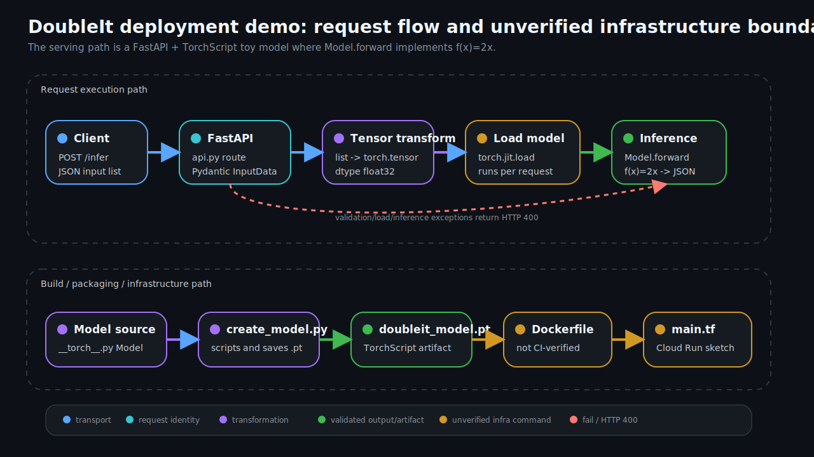

# DoubleIt Model Deployment

Small FastAPI and TorchScript demo for serving a model whose forward pass is the doubling map f(x)=2x.

Despite the repository name ending in `.py`, this is a multi-file system: model source (`__torch__.py`), model creation (`create_model.py`), serialized TorchScript artifact (`doubleit_model.pt`), local inference (`inference.py`), API service (`api.py`), tests, Docker packaging, and placeholder Terraform live together in the repo.

## Request and deployment flow



Execution path:

```text
POST /infer {"input": [1, 2, 3, 4]}
  -> FastAPI app in api.py
  -> Pydantic InputData validation
  -> torch.tensor(input, dtype=torch.float32)
  -> torch.jit.load("doubleit_model.pt") on each request
  -> TorchScript Model.forward, f(x)=2x
  -> {"output": [2.0, 4.0, 6.0, 8.0]}
```

Deployment path:

```text
__torch__.py Model -> create_model.py -> doubleit_model.pt
README / tests / api.py -> Dockerfile image -> optional container runtime
main.tf -> placeholder Google Cloud Run service definition
```

## Setup

Linux/macOS-style local setup:

```bash
python -m pip install --upgrade pip
pip install -r requirements.txt
```

Windows users can run the same Python commands from PowerShell or WSL2. The old notes about Docker Desktop and Terraform still apply only if you choose to exercise those optional infrastructure paths.

## Recreate the TorchScript artifact

```bash
python create_model.py
```

This rewrites `doubleit_model.pt` from `__torch__.py`.

## Run local inference

```bash
python inference.py
```

Expected output:

```text
tensor([2, 4, 6, 8])
```

## Serve with FastAPI

```bash
uvicorn api:app --host 0.0.0.0 --port 8000
```

Linux/macOS curl smoke:

```bash
curl -sS -X POST http://localhost:8000/infer \
  -H 'Content-Type: application/json' \
  -d '{"input": [1, 2, 3, 4]}'
```

Expected response:

```json
{"output":[2.0,4.0,6.0,8.0]}
```

PowerShell equivalent:

```powershell
Invoke-WebRequest -Uri http://localhost:8000/infer -Method Post -Headers @{"Content-Type"="application/json"} -Body '{"input": [1, 2, 3, 4]}'
```

## Tests and CI

```bash
python -m unittest discover tests
```

The GitHub Actions workflow installs `requirements.txt` and runs the unittest suite on push. It does not build Docker images, run containers, apply Terraform, or verify a live cloud deployment.

## Docker and Terraform status

Docker commands are present but are not CI-verified in this repository:

```bash
docker build -t doubleit-model-api .
docker run -p 8000:8000 doubleit-model-api
```

Terraform is a placeholder Cloud Run sketch in `main.tf`, not a verified deployment recipe. These commands are infrastructure-intent only until project ID, image publishing, authentication, provider configuration, and plan/apply gates are supplied and tested:

```bash
terraform -version
terraform init
terraform plan
terraform apply
```

## Current limitations

- `api.py` loads `doubleit_model.pt` inside the request handler, so the model is reloaded for every inference request.
- No authentication, authorization, rate limiting, monitoring, tracing, model registry, or rollout policy is implemented.
- `constants.pkl` and `data.pkl` are present but not used by the inference path.
- `requirements.txt` includes some packages that are not needed for the minimal FastAPI/TorchScript path.
- The service demonstrates transport and packaging mechanics for a toy f(x)=2x model; it is not a production ML serving stack.
